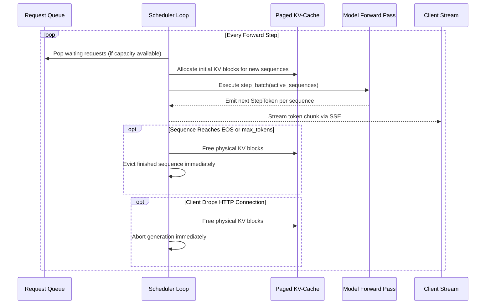

# Continuous Batching & Paged KV-Cache ⚡

Continuous batching (iteration-level scheduling) and paged memory allocation represent the core algorithmic engines powering high-throughput inference in Mini-Serve.

---

## 1. Iteration-Level Continuous Batching

Traditional inference servers utilize static batching, waiting for $N$ requests to arrive, padding them to the longest prompt, and keeping all sequences active until the slowest one completes. This creates:
1. **Head-of-Line Blocking**: Short 10-token queries sit idle waiting for 500-token queries to finish.
2. **GPU Underutilization**: Pad tokens waste GPU FLOPs without producing useful output.

### The Mini-Serve Continuous Batching Algorithm
Mini-Serve executes inference step-by-step at iteration granularity:



---

## 2. Paged KV-Cache Architecture

Standard KV caches pre-allocate contiguous virtual memory buffers for the maximum sequence length (e.g. 2,048 or 4,096 tokens). In production workloads, prompt and completion lengths vary widely, wasting 60%–80% of VRAM due to internal fragmentation.

### Block Allocation Strategy ([`src/cache/kv_cache.rs`](file:///Users/hkarimkonda/Documents/mini-serve-rs/src/cache/kv_cache.rs))
- **Block Size**: Non-contiguous fixed-size physical blocks (default: 16 tokens per block).
- **Page Table**: Each sequence holds a logical list of physical block IDs (`Vec<usize>`).
- **Free Stack**: Free block IDs are managed in an $O(1)$ stack.
- **Dynamic Allocation**: As a sequence generates new tokens, new blocks are allocated on-demand only when a 16-token boundary is crossed:
  $$\text{Required Blocks} = \left\lceil \frac{\text{len}(\text{prompt}) + \text{len}(\text{output})}{\text{block\_size}} \right\rceil$$

### Memory Fragmentation Telemetry
Mini-Serve continuously tracks real-time cache fragmentation and exposes it via `/api/status` and `/metrics`:

$$\text{Utilization} = \frac{\text{Allocated Blocks}}{\text{Total Physical Blocks}}$$

$$\text{Fragmentation} = \frac{\text{Unused Token Slots in Allocated Blocks}}{\text{Total Token Capacity of Allocated Blocks}}$$

---

## 3. Chained 16-Token Prefix Caching

When multiple requests share identical prompt prefixes (e.g., system instructions, few-shot examples, or retrieved context documents in RAG), repeating the prefill forward pass on those tokens is redundant.

### The Hashing & Lookup Algorithm ([`src/cache/prefix_cache.rs`](file:///Users/hkarimkonda/Documents/mini-serve-rs/src/cache/prefix_cache.rs))
1. Prompts are tokenized and partitioned into 16-token chunks:
   $$C_0 = [t_0, \dots, t_{15}], \quad C_1 = [t_{16}, \dots, t_{31}], \quad \dots$$
2. Each chunk is hashed using a chained cryptographic SHA-256 digest:
   $$H_0 = \text{SHA256}(C_0), \quad H_i = \text{SHA256}(H_{i-1} \,\|\, C_i)$$
3. If $H_i$ exists in the prefix cache:
   - Prefill computation for that 16-token chunk is completely bypassed.
   - The sequence points directly to the cached physical blocks.
4. **Eviction Policy**: Least-Recently-Used (LRU) bounded at 512 chunks (8,192 tokens).

---

## 4. Client-Disconnect Cooperative Cancellation

In high-concurrency production deployments, clients frequently cancel requests (e.g., user navigates away, closes browser tab, or timeout fires). Continuing to compute tokens for abandoned requests wastes valuable GPU FLOPs and blocks other users.

### Implementation
Each sequence stream in Mini-Serve communicates via a Tokio channel:
```rust
// Detected during the scheduler iteration loop:
if seq.sender.is_closed() {
    info!("Client disconnected for request {}, evicting immediately", seq.request_id);
    self.cache.lock().free_blocks(&seq.allocated_blocks);
    // Sequence removed from active batch before next forward pass
}
```
Cancellation takes effect within a **single token iteration** (< 25 ms), instantly releasing physical KV blocks.

